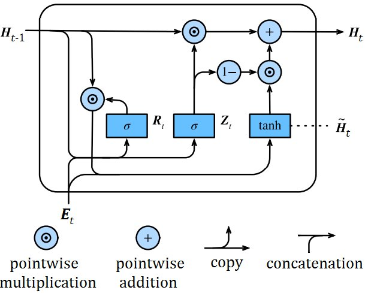
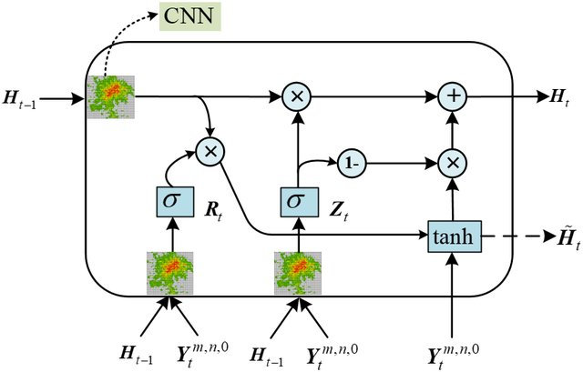

# Turing Completeness of Neural Networks

### D'Ambrosi Denis
##### March 2023

---

## Outline

1. Introduction
2. Theoretical Turing completeness of RNNs
3. Pratictical implementations of Turing-complete networks
4. Conclusions

---

## 1. Introduction

- Turing Machines
- Neural Networks

---

## Turing machines
##### Definition

Defined as a quadruple

$$(Q \cup \{q_{accept}, q_{reject}\}, \Gamma, \delta, q_0)$$

- $Q$ is a finite set of states
- $q_{accept}, q_{reject}$ are the final states that indicate the result of the computation
- $\Gamma$ is a finite alphabet of tape symbols
- $\delta$ is the transition function
- $q_0$ is the starting state

---

## Turing machines
##### Istantaneous descriptions

To study the evolution of a Turing Machine it's useful to consider the definition of an _istantaneous description_:

$$(q,l,r)$$

- $q$ is the current state of the machine
- $l$ is the tape to the left of the head
- $r$ is the tape to the right of the head

> Istantaneous descriptions can be considered as a "snapshot" of the machine at a given step

---

## Neural networks
##### Definition

Intuitively, a neural network is a directed graph of interconnected computing nodes (called _neurons_).

The local computation of each neuron $n$ can be summarized as the composition of three distinct functions:

- A _net_ function, which aggregates the values previously computed by the nodes that have an outgoing edge that terminates in $n$
- An _activation_ function, which combines the values computed by the net function and a threshold to determine the activation of the neuron
- An _output_ function, which transforms the activation into a value then passed to the following nodes within the graph

---

## Neural networks
##### Types of networks

There are many possible topologies of neural networks, but we can effectively classify them based on the presence or absence of loops within the _computational graph_:

- _FeedForward Neural Networks_ are acyclic, thus they only have a pre-determined number of steps before the computation comes to an halt
- _Recurrent Neural Networks_ allow loops in the topology to process input sequences of unbounded length

---

## 2. Theoretical Turing completeness of RNNs

- Turing completeness of general RNNs
- Turing completeness of modern architectures

---

## Turing completeness of general RNNs
##### Unbounded precision

We assume to have a discrete machine that is able to store and manipulate rational numbers with unbounded precision

We want to prove that, given a Turing machine $\mathcal{M}$ and an istantaneous description $x$, we are able to simulate $\mathcal{M}(x)$ through three cycles of computation of a RNN $\mathcal{T}_{W,b}$ executed with an encoding of $x$ as internal starting state.

---

## Turing completeness of general RNNs
##### Unbounded precision

Firstly we need to introduce the encoding function $\rho$.

$\rho$ concatenates multiple embeddings obtained through three auxiliary mappings:

- $\rho^{(q)}:Q \to \{0,1\}^{\lceil \log_2 Q \rceil}$ encodes the states $q_i \in Q$ as a binary enumeration
- $\rho^{(s)}: \Gamma^* \to \mathbb{Q}$ embeds the tape to the left or the right of the head using fractal encoding
- $\rho^{(r)}: \Gamma \to \{0,1\}^{|\Gamma|-1}$ encodes a single symbol of the alphabet $\Gamma$

---

## Turing completeness of general RNNs
###### Unbounded precision

A configuration of the machine can be thus encoded as

$$\rho(q, l, r) = \rho^{(q)}(q) \oplus \rho^{(s)}(l) \oplus \rho^{(s)}(r) \oplus \rho^{(r)}(l_1) \oplus \rho^{(r)}(r_1) \oplus \mathbf{0}$$

where $\oplus$ is the concatenation operator and $\mathbf{0}$ is a $|Q||\Gamma|+5$ vector of null values (that will be used to store auxiliary information during the simulation).

Note that $\rho$ is injective, thus we can define an inverse $\rho^{-1}$ that allows us to calculate the configuration corresponding to a valid encoding stored in the state of a RNN

---

## Turing completeness of general RNNs
##### Unbounded precision

The RNN we are going to construct uses the following functions:

- A weighted sum as _net_ function
- The linear staturated activation $\sigma$ as _activation_ function

$$\sigma(z) = 
\begin{cases}
    0 & \text{if } z < 0\\
    z & \text{if } 0 \leq z \leq 1\\
    1 & \text{if } z > 1
\end{cases}$$

- The identity as _output_ function

---

## Turing completeness of general RNNs
##### Unbounded precision

The state of the RNN at each timestamp $x(t)$ is defined recursively as following:

$$x(t+1) = \sigma(Wx(t) + b)$$

Where $x(0) = \rho(s)$ with $s$ configuration of the Turing machine $\mathcal{M}$ we want to simulate

---

## Turing completeness of general RNNs
##### Unbounded precision

Neurons within the network are partitioned into 6 main groups:

1. Stage neurons, that keep track in which of the 3 stages the RNN is
2. Entry neurons, which compute the combination of state and symbol under the head to determine the right transition according to $\mathcal{M}$'s $\delta$
3. Temporary tape neurons, which serve as a buffer to compute the transition of the head on the tape
4. Tape neurons, that encode the left and right tape in fractal encoding
5. Readout neurons, which encode the first symbol to the left and the right of the head
6. State neurons, that encode $\mathcal{M}$'s state

---

## Turing completeness of general RNNs
##### Unbounded precision

The simulation is executed during 3 main steps:

1. Entry neurons compute the state-symbol combination in order to determine the next transition according to $\mathcal{M}$'s $\delta$
2. State neurons and temporary tape neurons are updated according to the transition determined in the previous stage
3. In the third stage, tape neurons are updated with the temporary neurons' values

---

## Turing completeness of general RNNs
##### Unbounded precision

By applying the result we just outlined multiple times, we can simulate the complete computation of a Turing machine $\mathcal{M}$ over an arbitrary input string and compute the same function (if defined)

---

## Turing completeness of general RNNs
##### Growing memory modules

To remove the unbounded precision requirement, we can avoid to encode the entire tape into a single value by introducing two auxiliary stacks, each one controlled by two neurons $u$ and $o$ of the network

- if $u(t) > 0$, then a new neuron with the value $u(t)$ is pushed onto the stack and $u(t+1) = 0$.
- if $o(t) = 0$ and the stack is not empty, then the top neuron $n$ is popped from the stack and $o(t+1) = n$.
- if $o(t) = 0$ and the stack is empty, then $o(t+1) = c$ where $c$ is a default value.

---

## Turing completeness of general RNNs
##### Growing memory modules

We have to slighty modify the definition of the previously introduced $\rho$ to accomodate these changes:

- $\rho^{(s)}$ does not need to account for the infinite amount of blank symbols of the tape anymore
- $\rho^{(h)}:\{1,...,p\} \to \mathbb{Q}$ is used to encode the number of neurons of a tape $h(|l|), h(|r|)$ stored in the network at a given time ($p$ is the precision of the machine)
- $\rho^{(M)}:\Gamma^* \to \mathbb{Q}^*$ encodes the tape of the machine as a sequence of fractal encodings (computed with $\rho^{(s)}$) of at most $p$ symbols each

---

## Turing completeness of general RNNs
##### Growing memory modules

$\rho$ is thus defined as

$$\begin{align*}
\rho(q,s,l) = ( &\rho^{(q)}(q) \oplus \rho^{(s)}(l_{1:h(|l|)}) \oplus \rho^{(s)}(r_{1:h(|r|)})\\&\oplus \rho^{(s)}(l_{h(|l|)+1:h(|l|)+p}) \oplus \rho^{(s)}(l_{h(|r|)+1:h(|r|)+p})\\&\oplus \rho^{(r)}(l_1) \oplus \rho^{(r)}(r_1) \oplus \rho^{(h)}(h(|l|)) \oplus \rho^{(h)}(h(|r|)) \oplus \mathbf{0},\\&\rho^{(M)}(l), \rho^{(M)}(r))
\end{align*}$$

---

## Turing completeness of general RNNs
##### Growing memory modules

The "criterion" that allows the RNN to choose the stack-updating operation are the values of $h(|l|)$ and $h(|r|)$

Taking into consideration the left tape $l$, the value of $h(|l|)$ is updated to $h(|l'|)$ through the following cases:

$$
h(|l'|)=
    \begin{cases}
        h(|l|)-1 & \textrm{ if } d = L \textrm{ and } h(|l|) \geq 2\\
        p & \textrm{ if } d = L \textrm{ and } h(|l|) = 1\\
        h(|l|)+1 & \textrm{ if } d = R \textrm{ and } h(|l|) \leq p-1\\
        1 & \textrm{ if } d = R \textrm{ and } h(|l|) = p\\
    \end{cases}
$$

---

## Turing completeness of general RNNs
##### Growing memory modules

To succesfully simulate $\mathcal{M}$ with such architecture, we need 3 more categories of neurons:

7. Guard neurons, which will keep track of $h(|l|)$ and $h(|r|)$
8. Buffer neurons, that store temporary the values popped from the stacks
9. Push-pop neurons $(u_l, u_r)$ and $(o_l, o_r)$, which access the memory modules as described previously

---

## Turing completeness of general RNNs
##### Growing memory modules

The simulation is executed again during three main (analogous) steps. The main differences are:

- Tape neurons not only take into consideration temporary tapes, but also the values of the buffer neurons
- Readout neurons take into consideration also buffer neurons in the case of execution of a popping operation

---

## Turing completeness of general RNNs
##### Growing memory modules

As in the previous proof, by applying the RNN multiple (of 3) times, we can simulate the computation of the Turing machine $\mathcal{M}$

Although this architecture is technically implementable, the non-continuity of the stack-updating operations make all the learning methods based on differentiation unusable

---

## Turing completeness of general RNNs
##### Unbounded neurons

Another strategy to build a Turing-machine simulating network would be to allow an unlimited number of neurons in the architecture to overcome the problem of unbounded precision

To do so, we should, again, modify the encoding function $\rho$

- $\rho^{(M)}:Q^* \to \mathbb{Q}^{\lceil \frac{|l|+|r|}{p}\rceil}$ does the same thing as before, but instead of stacking the encoded parts of the tapes, it concatenates them into a vector
- $\rho^{(d)}:Q^* \to \{0,1\}^{\lceil \frac{|l|+|r|}{p}\rceil}$ embeds (with a one-hot-encoding) the coordinate of the last neuron encoding at least a non-blank symbol

---

## Turing completeness of general RNNs
##### Unbounded neurons

Again, we need to include some additional categories of nodes (but we can forget pop-push neurons of course):

9. Stack neurons are introduced to replace growing memory modules
10. Pointer neurons, that must keep track of which neurons contain relevant information about the encoded tapes

Moreover, buffer neurons do not access values within the external modules, but, instead, read values from the last non-zero values of the stack neurons

---

## Turing completeness of general RNNs
##### Unbounded neurons

The simulation is analogous to the previous one, apart from the last stage, where the newly introduced neurons are used to update the "emulated" stacks: if the tape neuron holds less than $1$ symbol after the update, we pop the stack node (that is, setting the last non-zero stack neuron to $0$, changing the relative pointer nodes and updating the tape and readout values).
On the other hand, if the tape neuron holds more than $p$ symbols after the update, we push the bottom $p$ symbols of the tape node onto the stack neurons (by setting the first zero neuron pointed by the pointer nodes to the value to be pushed).

---

## Turing completeness of modern architectures
##### Models based on attention

Introduced in 2017, the Transformer-based networks have taken the Natural Language Processing world by storm

A _Transformer_ consists in a modular architecture composed by two main types of independent components:

- Encoders, which analyze a sequence of embedded symbols to find relations between the input tokens
- Decoders, which exploit the found relations to produce a sensible transformation on the input

---

## Turing completeness of modern architectures
##### Models based on attention

Transformers introduced two key innovations:

1. Positional encodings, which allow for parallel computation of sequences while still preserving ordering information
2. Self-attention, which exploits the previous point to (potentially) attend at each position of the input sequence at once

---

## Turing completeness of modern architectures
##### Models based on attention

---

## Turing completeness of modern architectures
##### Models based on attention

The architecture taken into consideration for the Turing completeness proof present some slight modification from the original concept:

- Instead of a system made up of $N$ encoders and $N$ decoders, our architecture has $1$ encoder and $3$ decoders. The output of the last decoder is then fed again as input to the first one to provide looping capabilities
- We take into consideration only rational activations, thus the following functions have been changed:
    - The softmax function ($\sigma(x_i) = \frac{e^{x_i}}{\sum_{j=1}^{n} e^{x_j}}$) has been replaced by hardmax attention ($\sigma(x_i)=\frac{1}{m} \leftrightarrow x_i = \max(x)$, where $m$ is the number of maximal values within $x$)
    - The original positional encodings, based on trigonometric functions, have been changed with a polynomial alternative

---

## Turing completeness of modern architectures
##### Models based on attention

We want to show that, given a Turing machine $\mathcal{M}$, we can construct a transformer architecture $\textrm{Trans}_{\mathcal{M}}$ such that, for any input string $w, n=|w|$, $\mathcal{M}(w) = \textrm{Trans}_{\mathcal{M}}(w)$

---

## Turing completeness of modern architectures
##### Models based on attention

The first encoder receives $w$ after a transformation obtained via an embedding procedure and the positional encodings function

It outputs a pair $(K^e,V^e)$, where

- $K^e = k_1,...,k_n$ is a vector of embeddings that encode the indexes of $w$'s symbols
- $V^e = v_1,...,v_n$ is a vector of embeddings that encode both the indexes and the symbols of $w$

---

## Turing completeness of modern architectures
##### Models based on attention

The first decoder receives both $(K^e,V^e)$ and a valid encoding of the starting configuration $(q_0,s_0)$ as input: our objective is to produce the sequence $(q_0,s_0),(q_1,s_1)$ as output of the last decoder.

More generally, the proof is inductive and wants to show that it's possible, given the sequence $(q_0,s_0),(q_1,s_1),...,(q_{t-1},s_{t-1}),(q_t,s_t)$ as input for the first decoder, to produce $(q_{t+1},s_{t+1})$ and append it to the sequence before the next cycle

---

## Turing completeness of modern architectures
##### Models based on attention

The first layer uses the input sequence and $(K^e,V^e)$ to produce an embedding vector which encodes $(q_{t+1}, v_{t+1}, m_{t+1})$, where

- $q_{t+1} \in Q_\mathcal{M}$ is the next state of the configuration
- $v_{t+1} \in \Gamma_\mathcal{M}$ is the symbol written by the head
- $m_{t+1} \in \{-1,0,1\}$ is the movement of the head

In fact, this component implements $\mathcal{M}$'s transition function $\delta$

---

## Turing completeness of modern architectures
##### Models based on attention

The second decoder uses the previously computed information of the sequence to compute the position of the head $c_{t+1}$

It's easy to see that

$$c_{t+1} = \sum_{i \in \{0,...,t+1\}} m_i$$

---

## Turing completeness of modern architectures
##### Models based on attention

The last decoder computes $s_{t+1}$ by calculating the last timestamp $i$ during which the had was in position $c_{t+1}$:

$$s_{t+1} = v_i$$

since it was the last symbol written in the corrisponding location

Finally, it needs to re-structure the data to successfully output a valid embedding of $(q_{t+1},s_{t+1})$

---

## Turing completeness of modern architectures
##### Models based on recurrent convolutions

_Convolutional Neural Networks_ were intially designed to process grid-arranged data by sliding a set of filters over the input to extract relevant features from it before applying standard feed forward layers

The most obvious application of such an architecture is in the computer vision field, since images can be naturally saved as multi-dimensional grids of pixels

---

## Turing completeness of modern architectures
##### Models based on recurrent convolutions

Alternatively, in order to process sequential data, convolutional layers can be implement within recurrent architectures to both extract local features from data and capture temporal relationships between information

An example of this would be in the _convolutional GRU_

---

## Turing completeness of modern architectures
##### Models based on recurrent convolutions

---

## Turing completeness of modern architectures
##### Models based on recurrent convolutions

---

## Turing completeness of modern architectures
##### Models based on recurrent convolutions

Based on the idea of a CGRU, in 2015 the concept of a _Neural GPU_ was proposed

It consists in a $l$-layer CGRU, where all the input sequence must be concatenated and encoded through an embedding matrix into the initial state of the system to avoid unfolding through time during the training phase

---

## Turing completeness of modern architectures
##### Models based on recurrent convolutions

The size of the bias parameters in a standard Neural GPU depends on the length of the input sequence

The Turing completeness requires a slightly modified version of the architecture to fix the number of parameters in the bias vectors and, thus, obtain a fixed architecture: this modified network is called a _uniform GPU_

---

## Turing completeness of modern architectures
##### Models based on recurrent convolutions

It can be shown that uniform Neural GPUs, if given looping capabilities, can simulate any encoder-decoder RNN, which evolution can be described through the following equations:

$$\begin{align}
    h_i &= \sigma(x_iW + h_{i-1}V)\\
    g_t &= \sigma(g_{t-1}U)
\end{align}$$

Where $x, |x|=n$ is the input string, $h_0 = \mathbf{0}$ is the initial state of the encoder, $g_0 = h_n$ is the input of the decoder and $W,V,U$ are weight matrices

---

## Turing completeness of modern architectures
##### Models based on recurrent convolutions

The proof can be sketched as follows:

During the $t$-th cycle of computation of the Neural GPU, the $t$-th component of the state of the architecture $\mathbf{S}_{t,1,:}$ is computed based on the previous activations. Given that the size of the internal state of the network we want to simulate has size $d$, we can see $\mathbf{S}_{t,1,:}$ as two stacked vectors, $\mathbf{E}_t = \mathbf{S}_{t,1,1:d}$ and $\mathbf{D}_t = \mathbf{S}_{t,1,d+1:2d+1}$

---

## Turing completeness of modern architectures
##### Models based on recurrent convolutions

During the simulation, these vectors will have the same values as the outputs of the encoder and the decoder (respectively) of the RNN:

$$\begin{align}
\mathbf{E}_t &= h_t\\
\mathbf{D}_{n+t} &= g_t
\end{align}$$

Remember that $n$ is the length of the input string, thus the discrepancy of the indexes is due to the preprocessing steps of the encoder

---

## Turing completeness of modern architectures
##### Models based on recurrent convolutions

It's possible to show (by reduction to the previously introduced results) that encoder-decoder RNNs are Turing complete, thus also uniform Neural GPUs have the same expressiveness

Interestingly, this computational power is easily lost if we change even so slightly the convolutional features of the architecture:

- if we exchange _zero-padding_ with _circular convolutions_
- if we take into consideration $(1,1,d,d)$ sized filters instead of $(2,1,d,d)$ (in this case each value of $\mathbf{S}_t$ would only depend from the activation of the same cell in $\mathbf{S}_{t-1}$)

---

## 3. Practical implementations of Turing-complete networks

- The Neural Turing Machine
- The Differentiable Neural Computer

---

## Practical implementations of Turing-complete networks
##### The Neural Turing Machine

A _Neural Turing Machine_ is an architecture composed of two main modules:

- A (neural network) controller
- A memory matrix (made up of a set of vectors that we will call _locations_)

The memory is accessed in reading and writing only through completely differentiable operations executed by the _read_ and _write head_

---

## Practical implementations of Turing-complete networks
##### The Neural Turing Machine

At each timestamp, the controller receives an input and produces:

- A _raw output_ vector
- An _interface_ vector, used to update and read from the memory module

The values contained in the raw vector will be then combined with the information read from the memory to provide the actual output for the current timestamp

---

## Practical implementations of Turing-complete networks
##### The Neural Turing Machine

At each timestamp $t$, the objective of the network is to compute a probability distributions over the rows of the memory module to access the stored information as a complex combination over the different locations

We will call these distribution _weighting_ $w_t$

---

## Practical implementations of Turing-complete networks
##### The Neural Turing Machine

To determine $w_t$ we need to compute a set of auxiliary values:

- A _content-addressing weighting_ $w_t^c$, which uses a softmax calculation to determine a probability distribution over the locations according to the (cosine) similarity of each row to a vector output by the controller (called the _key_ $k_t$)
- An _interpolation weighting_ $w_t^g$ that combines $w_t^c$ with $w_{t-1}$ through a mechanism very similar to the GRU's update gate
- A _convolution weighting_ $\tilde{w}_t$ that uses $w_t^g$ and a _shift vector_ $s_t$ output by the controller to determine the degree of left or right shifts in the read and write operations of the memory matrix

---

## Practical implementations of Turing-complete networks
##### The Neural Turing Machine

$\tilde{w}_t$ is passed through a last softmax application to determine the final weighting for the timestamp $w_t$

This weighting is used to access the memory $M_t$ both in reading and writing:

- Writing: $M_t = M_{t-1} \odot (\mathbf{1}-w_t e_t^T) + w_t a_t^T$
- Reading: $r_t = M_t^T w_t$

Where $\mathbf{1}$ is a matrix of the same size of $M_t$ of only ones, $\odot$ is the pointwise multiplication, $e_t$ and $a_t$ are, respectively, the _erase_ and _add vectors_ output by the controller

---

## Practical implementations of Turing-complete networks
##### The Neural Turing Machine

This machine could, potentially, learn through backpropagation how to simulate a space-bounded Turing machine

In practice, its training process would be lenghty due to its non parallelizable nature

Furthermore, it lacks the mechanisms to deliberately free unused memory and to ensure that "allocated" blocks do not overlap each other, thus limiting its ability to process extended sequences

---

## Practical implementations of Turing-complete networks
##### The Differentiable Neural Computer

The same research team that introduced the Neural Turing Machine in 2014 rivisited the concept two years later to overcome some of the issues arisen

In 2016 they presented the _Differentiable Neural Computer_, an inproved version of the NTM capable of re-using memory with mechanism very similar to regular computers' memory management procedures

---

## Practical implementations of Turing-complete networks
##### The Differentiable Neural Computer

With respect to the NTM, the DNC allows for multiple read heads, but essentially the memory access equations remain the same as before (although a little generalized to account of more read vectors)

On the other hand, the operations that define the weightings (that are separated into _read_ and _write_ weightings this time) are different

---

## Practical implementations of Turing-complete networks
##### The Differentiable Neural Computer

Write weightings now take into consideration how much a location is allocable: each address' allocability is directly proportional to the intensity of the last writing operation and inverserly proportional to the last reading operation that was executed on it

By doing this through a careful set of operations, we can define a differentiable analogous to the classical _free list_, that allows us to ensure that important data is not overwritten by the last operations

If, on the other hand, we specifically wanted to overwrite a location, we still had content-based addressing at our disposal

The discrimination between the two modes is done through an interpolation procedure

---

## Practical implementations of Turing-complete networks
##### The Differentiable Neural Computer

Similarly, we could either read from memory through content-based addressing or by accessing a _memory linkage matrix_: we store a separated data structure that keeps track of how much every location was written to with respect to all the others in the last "intense" writing operation to preserve sequential information

This structure can be accessed either "normally" or "in reverse" (in practice, trasposed) to read or write data in the same order as before

Again, the mediation between the three access modes is obtained through a convex combination with a probability distribution output by the controller

---

## 4. Conclusions

- Summary
- Future work

---

## Conclusions
##### Summary

In this presentation, we took a look at the expressive power of neural networks from multiple perspectives:

- We analyzed some more theoretical results, which showed us that RNNs can be seen as a reasonable model of computation
- We presented some practical implementations of (potentially) Turing complete architectures, which may be the next step towards a truly general A.I.

---

## Conclusions
##### Future work

In the future we may expect developments in the following areas:

1. An alternative learning paradigm that doesn't require differentiation to actually implement the growing memory modules architecture
2. An alternative version of the growing memory modules that allow for differentiable alternatives to the standard stack operations
3. Further exploring in the memory-augmented neural networks field for algorithms learning